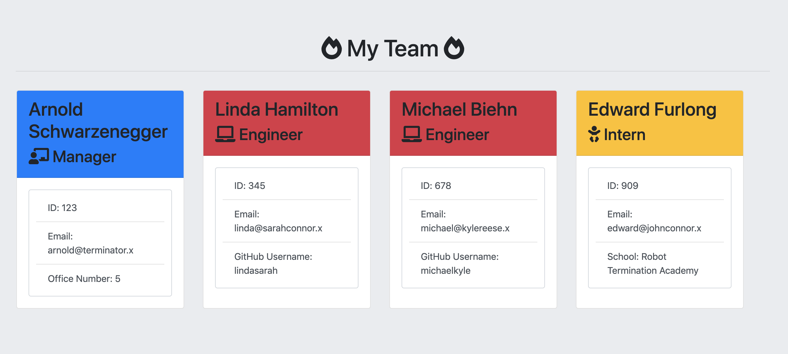

# Homework 10: Employee Summary

## Project:

This is a Node CLI application that allows you to generate an HTML page that shows each member of a software engineering team. The application first prompts you for information about the team manager, and then for information about the team members. you can enter data for any number of team members, and they may be a mix of engineers and interns.  The data collected are email, id, and specific information based on their role with the company).

* Below is an example of what the output looks like.

## Steps to run the application:

1. Navigate to the `Develop` folder in the termimal
2. Run `npm install`
3. Run `node main.js`
4. Follow the prompts to enter your team data
5. Open the `Output/index.html` in your browser to view the results
6. If desired, you can run the unit tests using `npm run test` inside of the `test` directory

## Dependencies:

This application uses the [inquirer](https://www.npmjs.com/package/inquirer) to prompte for information from the user.

It uses [jest](https://jestjs.io/) for running the provided unit tests.
